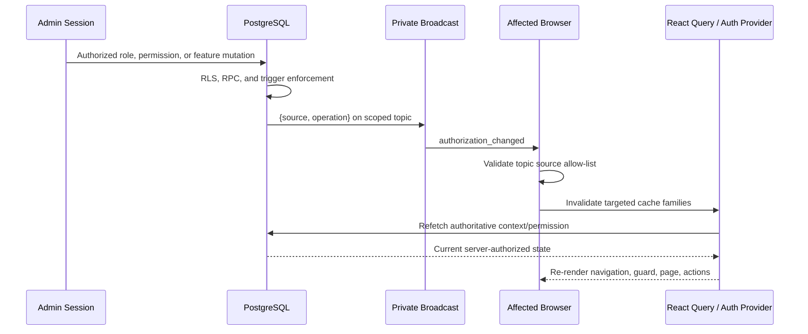

# Realtime Architecture

## Table of Contents

- [Purpose](#purpose)
- [Scope](#scope)
- [Broadcast Model](#broadcast-model)
- [Authorization Scopes](#authorization-scopes)
- [Event Routing and Cache Invalidation](#event-routing-and-cache-invalidation)
- [Subscription Lifecycle](#subscription-lifecycle)
- [Browser Synchronization](#browser-synchronization)
- [Performance Model](#performance-model)
- [Design Decisions](#design-decisions)
- [Architecture Invariants](#architecture-invariants)
- [Future Considerations](#future-considerations)
- [Related Documents](#related-documents)

## Purpose

Define how Realtime events synchronize Kanisa Connect clients while preserving tenant isolation, authoritative database decisions, and bounded subscription lifecycle.

## Scope

The primary focus is implemented authorization Broadcast. Other feature-specific Realtime subscriptions must follow the same ownership, cleanup, and performance principles but are not automatically part of the authorization channel set.

## Broadcast Model

PostgreSQL triggers call private Supabase Broadcast with a minimal payload containing source and operation. No role, permission, profile, subscription, or tenant row is trusted from the message.

The browser uses the event to invalidate targeted React Query keys and refetch authoritative tables/RPCs. This supports INSERT, UPDATE, and DELETE without relying on unsafe DELETE row payload filtering.

## Authorization Scopes

| Scope | Topic | Sources | Subscription rule |
|---|---|---|---|
| User | `authorization:user:<user_id>` | `user_roles`, `members`, `profiles` | Matching authenticated user only |
| Church | `authorization:church:<church_id>` | `church_role_permissions`, `church_features`, `subscriptions` | Current role holder or active member of that church |
| Platform | `authorization:platform` | `platform_features` | Authenticated sessions; minimal payload only |

The accepted invariant is:

> Exactly one non-duplicated authorization channel per authorization scope.

## Event Routing and Cache Invalidation

User events invalidate permission, role-permission, portal-feature, and subscription-plan families and refresh the current user context. Church permission, feature, and subscription events invalidate only their dependent cache families. Platform events invalidate platform-feature and permission decisions.

Handlers maintain explicit source allow-lists. A message never directly grants access. If an authoritative refresh fails, privileged cached decisions are removed.

## Subscription Lifecycle

The authentication provider owns one channel factory and one collection. The effect depends on current user and active church.

- On subscribe, it closes the initial fetch/subscription race with invalidation and authoritative user refresh where required.
- On user or church change, cleanup marks prior handlers inactive and removes all prior channels.
- On logout, the prior authenticated effect cleans up and authorization context resets.
- On provider teardown, every channel in the collection is removed.
- If asynchronous `setAuth()` resolves after cleanup, the active check prevents late subscription.

Pages must not create overlapping authorization channels.

## Browser Synchronization

An open session updates without refresh, logout, new tab, or storage clearing. Navigation and mutation controls change; route guards redirect or show access denied; newly granted routes become usable. Server RLS/triggers remain final if the UI is stale.

Verified staging propagation for representative grant/revoke scenarios was 651–1,704 ms. Stale protected mutations were denied with HTTP 403 / SQLSTATE `42501`.

## Performance Model

Three logical authorization topics are a fixed per-session bound and are multiplexed through the Supabase Realtime client. A global topic was rejected because it would fan every tenant event to unrelated sessions and cause broad refetching.

At scale:

- broadcast only minimal signals;
- keep topics tenant/user scoped;
- invalidate targeted keys;
- avoid page-local duplicates and aggressive polling;
- measure connection, delivery, refetch, and failure rates; and
- protect database hot paths used after invalidation.

## Design Decisions

- Broadcast replaces row-payload authorization synchronization.
- Three identity scopes match what database triggers can route safely.
- Realtime carries invalidation, never authority.
- Centralized lifecycle avoids duplicate subscriptions.
- Failure removes stale privilege and relies on server enforcement.

## Architecture Invariants

- Exactly one active authorization channel exists per scope.
- Church topics never admit other-church users.
- Broadcast payload data is not applied as permission state.
- All channels unsubscribe on identity/context teardown.
- Realtime failure cannot make a server mutation authorized.
- New authorization sources map to one reviewed scope and targeted invalidations.

## Future Considerations

**Future Enhancement:** production delivery metrics, reconnect/backoff dashboards, synthetic authorization propagation checks, and capacity testing across thousands of churches. A new scope requires an architecture and policy review; it must not be added merely for page convenience.

## Related Documents

- [Authorization Architecture](AUTHORIZATION_ARCHITECTURE.md)
- [Scalability Architecture](SCALABILITY_ARCHITECTURE.md)
- [Observability Architecture](OBSERVABILITY_ARCHITECTURE.md)
